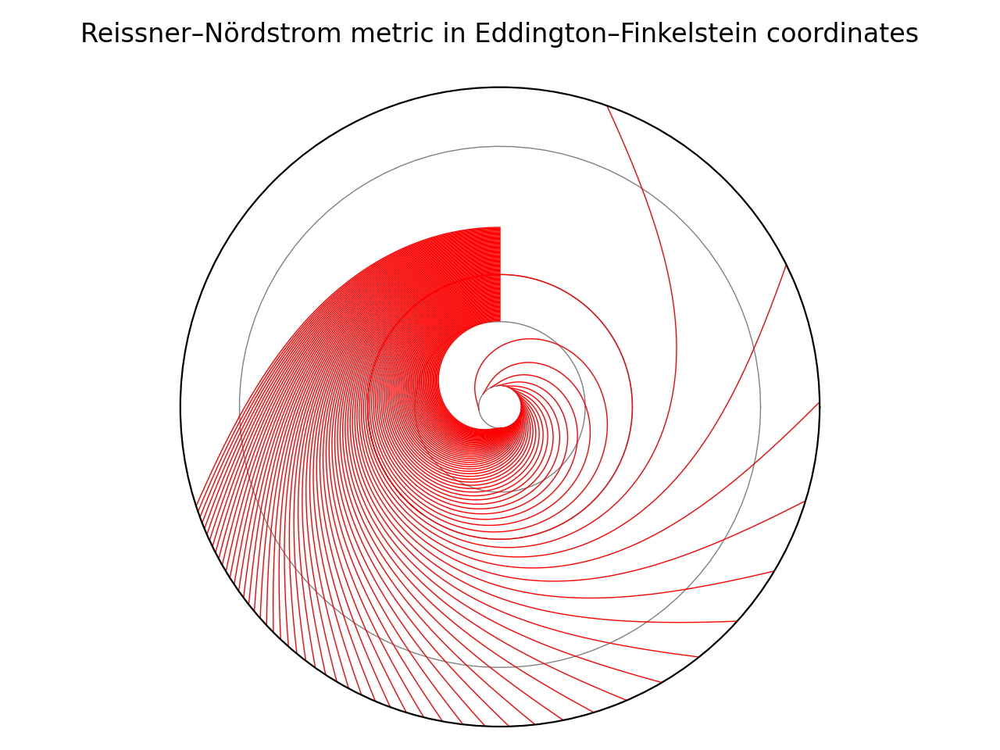

# General relativity

Diagram showing trajectories of null (lightlike) geodesics launched perpendicular to the radial direction:

Circles inside out:

* Inner (Cauchy) horizon
* Outer (event) horizon
* [Photon sphere](https://en.wikipedia.org/wiki/Photon_sphere)
* [Innermost stable circular orbit (ISCO)](https://en.wikipedia.org/wiki/Innermost_stable_circular_orbit)
